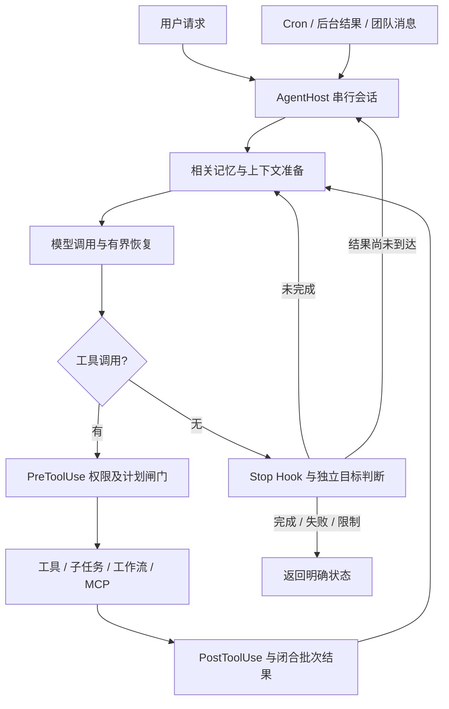

# 集成运行时

## 核心数据流

## 服务边界

`Agent` 只驱动模型与工具；`HookManager` 管理事件回调；`ServiceTool` 把宿主服务适配为工具并把异常转换为模型可读结果。`AgentHost` 管理一段 history 与锁，只有 CLI 主执行线程修改 Lead 会话。终端读取线程只向输入队列写入文本，队友只修改自己的消息历史。

SQLite WAL、短事务和 BEGIN IMMEDIATE 提供状态原子性和并发认领。连接上下文提交/回滚后立即关闭，避免 Windows 临时目录清理时的文件占用。SQLite 状态不意味着整个模型任务具有事务性：代码和命令副作用不能随数据库回滚。

## 三类执行单元

- 一次性子 Agent：fresh history，一层委派，最终文本返回父工具结果。
- 持久队友：独立 history、owner 与任务目录，收件箱通信，IDLE 扫描 ready task，失败时释放未完成任务并停止该队友。
- Workflow：宿主预注册 async 编排，通过无终端审批的 runner 执行子调用，结构输出校验一次重试，语义键缓存已成功结果。

队友同一任务轮内完成任务后仍使用原 cwd；回到 IDLE 才释放目录并增加版本。审批记录绑定 task_id/version，普通消息不修改版本。shell 和修改工具在 required/pending/rejected 状态下被拦截。

## 持久性与恢复

| 数据 | 恢复方式 | 不能保证的内容 |
| --- | --- | --- |
| 记忆 | 相关关键词召回正文 | 完全正确的自动提取和相关性 |
| 任务 | get/list 读取状态与 owner | 崩溃中断任务的自动完成 |
| Cron | pending_delivery 重投，成功响应后 ack | exactly-once、停机补跑 |
| 消息 | 收件箱事务消费 | 进程在消费后崩溃时的完整会话恢复 |
| Workflow | 原 run_id、名称和参数，语义键复用 | 外部状态变化后的缓存有效性 |
| Goal | 查看保留的 active/status | 自动恢复旧模型对话和验证证据 |

工作流崩溃留下 `.lock` 时，确认没有活动进程后才能人工处理；不要直接清除 `.repopilot/`，其中可能存在尚未合并的 worktree 分支。任务中断时先检查仓库与 owner 状态，再通过宿主 TaskStore.release 恢复 pending。当前队友线程不会自动复活。

## 模型错误恢复

主请求、摘要和独立判断采用有界重试：连接/超时及 429/5xx 最多三次，指数退避；可配置 503/529 的备用模型。回复被 max_tokens 截断时重新请求并提高上限，不执行未完成的工具参数。上下文过长在 Agent 层触发保留配对最近消息的摘要，然后重试一次。摘要失败不替换原历史；目标判断失败保留 active goal 并返回错误。

## 扩展位置

新工具继承 Tool 或使用 ServiceTool，再注册到 ToolRegistry。新行为通过 HookManager.register 接入，无需把权限、日志等直接写进循环。新 Workflow 必须由宿主注册，名称、输入与输出遵守显式 schema 子集。新的模型实现需要 chat、summarize、decide 三个边界，测试可以注入 ScriptedLLM 以隔离网络。
